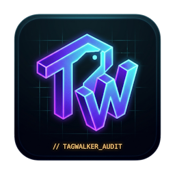
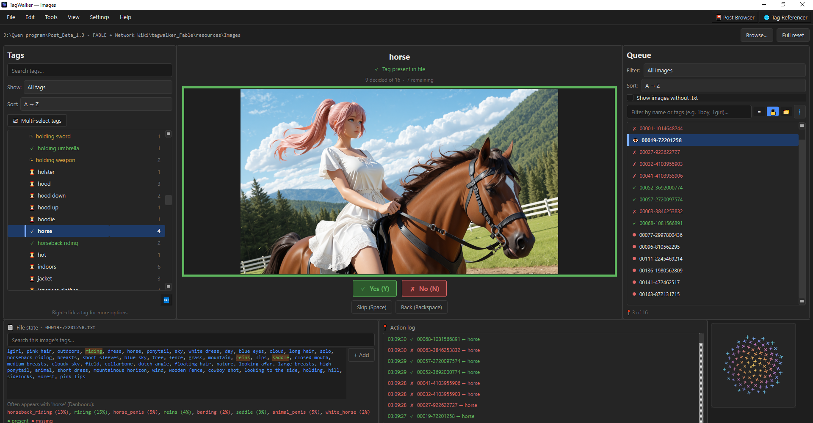
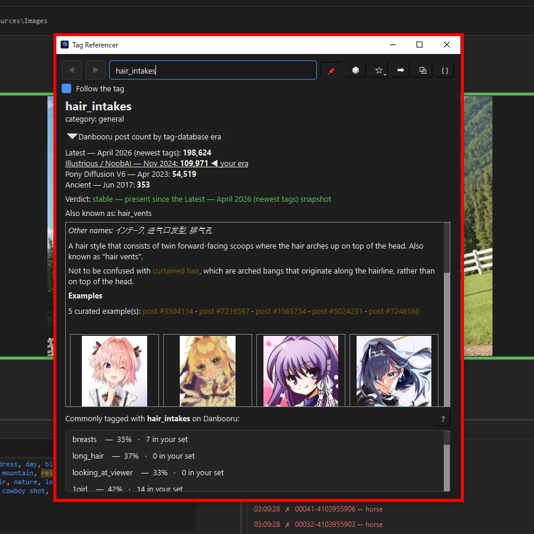
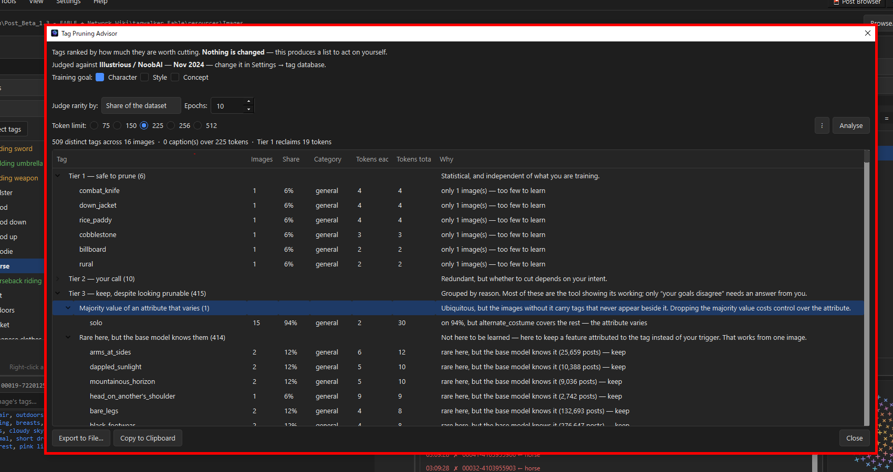
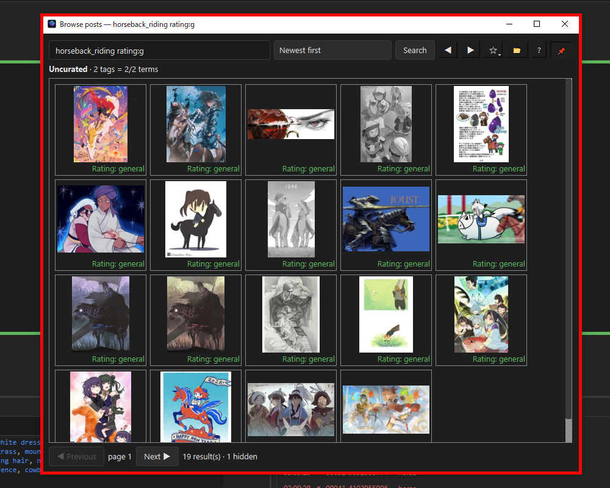

# Deepbooru TagWalker



---

## Three things that have probably happened to you

**Your character LoRA started putting her in the same outfit every time.**
You never asked for that. It happened because something in your captions was on nearly every image and never got named — so the model attached it to your trigger word instead. Now it fires whether you want it or not.

**You prompted a tag and nothing happened.**
The tag is real. Danbooru has it. But your base model was trained before it caught on: `hair_intakes` sat on 353 posts in 2017 and sits on 198,624 today. If you trained on an older base, you spent tokens on a word it has never meaningfully seen.

**Your training got worse as it went, and you don't know why.**
Captions have a token limit. Go past it and the tail is cut — silently. With caption shuffling on, a *different* tail is cut every step, so the model gets contradictory supervision that never settles. Nothing warns you. The image quality just degrades.

None of these announce themselves. Every one of them is measurable before you start training.

---

## What TagWalker does

Point it at a folder of images and `.txt` captions. It shows you one image and one tag at a time and asks: *does this tag belong here?* Yes, No, Skip, Back. Captions are rewritten on disk the moment you answer.

That part is simple, and it is not the interesting part.

The interesting part is that TagWalker treats a caption set as **training data with properties you can measure** — which tags your base model has actually seen, which are too rare to learn, which will be truncated away, and which are quietly fusing into your trigger.



---

## What makes it different

Three tools, each answering one of the problems above. I have not found these anywhere else.

### 1. Does your base model even know this tag?

*Answers the second problem.*

Danbooru's vocabulary drifts. Tags get renamed, retired, or invented long after your base model finished training — and a tag your model has never seen contributes nothing but wasted tokens.

Look up any tag and see how many posts carried it across **four dated snapshots**: 2017, Pony-era 2023, Illustrious/NoobAI 2024, and current. `hair_intakes` reads 353 → 54,519 → 109,971 → 198,624. `ai-generated` reads 0 → 0 → 6,202 → 15,010, so on anything before 2024 it is simply a word your model has never met.

A one-line verdict says whether the tag is stable, was renamed since, or postdates your data entirely. The Danbooru wiki page and its curated examples load alongside it, so you can see what the tag actually means rather than guessing from its name.

**Compare mode** puts two tags side by side with their post counts and how much of their usual company they share — which answers the question you really have: *are these two interchangeable, or not?*



### 2. Which tags are fusing into your trigger?

*Answers the first problem.*

The Pruning Advisor ranks every tag by how much it is worth cutting, in three tiers, and **explains every verdict**. It writes nothing — it produces a list you act on yourself.

What it knows that a word-frequency counter does not:

- **A rare tag your base model already knows is not useless.** `elf` on three images cannot teach a model what an elf is — but it is not trying to. It is naming a feature so that feature attaches to *the tag* rather than to your trigger. That job works from one image.
- **A tag on 90% of your images is not automatically a constant.** If the other 10% carry `2girls`, subject count *varies* in your dataset and `1girl` is merely its majority value. Drop it and every generation fights a bias welded into your trigger. This is worked out from your own captions, so it catches your vocabulary as readily as the obvious cases.
- **Your trigger token is never a candidate.** Being on every image is what makes an ordinary tag droppable; for the trigger, that ubiquity is the entire mechanism.



### 3. What will be cut before training even sees it?

*Answers the third problem.*

The statistics window reports on the dataset as a training artifact, not on how far through the work you are:

- **Caption length** against the limits that actually bite, counted with the tokeniser your trainer actually uses — CLIP for SDXL, or the T5 / Qwen3 / Mistral tokenisers for the Flux families — and a plain statement of how many captions will be truncated.
- **Tags per image.** A wide spread means some images are described far more thoroughly than others, so the model is taught unevenly. Nothing else surfaces this.
- **Your vocabulary versus the base model.** How many of your tags the selected snapshot knows well, barely, or has never seen. That last group is your own tokens — or your typos.
- **Where your captions diverge from Danbooru.** Pairings you use far more than the site does (the signature of what you are teaching, or a correlation about to be baked in), and pairings the base model expects that your captions leave unwritten.


### And a Danbooru browser, because it needed one

Uncurated search in its own window, for seeing how a tag is used in practice rather than only the examples a wiki editor chose. Full-size viewing, bookmarks, an editable content blacklist, and downloads named however you like.

It is also, incidentally, faster than browsing Danbooru in a browser.



---

## What using it actually looks like

A dozen tools with no stated order is a menu, not a workflow. This is
the sequence that works — it is also in the program, under
**Help → Getting Started**.

**0. Copy your caption files somewhere safe.** TagWalker writes on
every answer, and undo covers the current session only. Ten seconds of
insurance.

**1. Look before you change anything.** Health Check finds missing or
unreadable captions; Dataset health shows caption lengths against the
token limit and how much of your vocabulary the base model knows.
Five minutes here tells you which of the following steps you need.

**2. Fix the mechanical errors.** Tag audit for typos and renamed
tags, duplicate cleanup, delete the obvious junk. No judgement
involved, all in bulk, each a single undo.

**2b. Catch contradictions.** Conflict Rules finds captions that say
two things at once — `indoors` with `outdoors`, or `cat_ears` without
`animal_ears`. Add your own; for a specific dataset yours are the
useful ones.

One thing to know: **rules are unconditional.** `long_hair` +
`short_hair` is obviously wrong for a solo character and perfectly
correct for a two-character scene, and you can't express "only when
solo".

That's a reason to review rather than to abstain — every violation has
a **View image** button, so you look and decide that case on its own,
and nothing is changed until you choose. An over-reporting rule costs
time, not accuracy. Just don't fix in bulk without looking.

**3. Add your trigger word** if the tagger didn't. Once it's on one
image, select it in the tag tree, highlight the whole queue, and one
Yes applies it to everything.

**4. Prune.** The advisor's Tier 1 is safe to cut and every verdict is
explained. Set your training goal first — a character LoRA and a style
LoRA want opposite things from the same tag.

**5. Walk the tags.** This is the work, and how far you take it is
your call. The program is built for a **complete audit** — a tag
counts as done only when every image carrying it has a Yes or a No,
and the completion percentage tracks exactly that. At 100% you *know*
the captions are right rather than hoping they are.

Two settings decide how long that takes. **Auto-confirm** answers Yes
for images the tagger already tagged, leaving you only the ones it may
have missed — the single biggest lever, and still undoable. The
**filter mode** narrows the queue further, turning a verification pass
into a spotting pass.

Stopping short is legitimate; the percentage just makes it a decision
rather than an accident.

**6. Check before training.** Caption lengths again — against the limit
for *your* trainer (225 on SDXL, 512 on the Flux families; the counter
knows the difference). Anything past the limit loses its tail — and
with caption shuffling on, a *different* tail every step.

**Steps 1–4 run about twenty minutes**, and cost roughly the same at
64 images or 2,000 — that part doesn't scale with your dataset.

**Step 5 is the one that does.** A complete audit of 64 images is a
full day. With auto-confirm on and the filter narrowed, considerably
less. Walking only the tags that decide your concept, under an hour.
All three are valid; the completion percentage keeps the choice
visible.

---

## The rest of the toolkit

**The walk.** Keyboard-driven Yes / No / Skip / Back. Captions written atomically, so a crash can never leave a half-written file. The queue colour-codes every image and a bar marks the row the program is on.

**Sessions that survive anything.** Autosave on a timer and on action count. Close mid-audit, come back next week, reload: every decision and your exact position. If the dataset changed on disk in between, TagWalker reconciles and tells you what drifted.

**Batch tools.** Rename a tag across the dataset with auto-merge, split one tag into several, delete everywhere, one-click duplicate cleanup — each a single undo step, each naming any file it could not write.

**Tag audit.** A bundled 201,269-tag database checks your whole list for typos, deprecated tags and unknown inventions, and offers fixes you can apply and undo in one shot.

**Conflict rules.** Tags that must never coexist (`indoors` + `outdoors`) or that require another (`cat_ears` → `animal_ears`). Scan the dataset, fix violations from one dialog.

**Token counter — now for four trainer families, not just SDXL.** Counts each caption's tokens with the *actual* tokeniser your trainer uses, because the right ruler depends on the model: **SDXL/Illustrious** (CLIP, 75/150/225), **Flux.1** (T5-XXL), **Flux.2 [klein]** (Qwen3), and **Flux.2 [dev]** (Mistral's Tekken). Pick your target and the limit, thresholds and per-tag costs all follow it — counting a Flux caption with CLIP's ruler was quietly wrong, and this fixes it. A marker renames over-limit files so they sort to the top of the folder. The Flux tokenisers load only when selected (zero startup cost), and the Mistral one is a from-scratch pure-Python reader validated token-for-token against Mistral's own library — so it adds ~3 MB, not the ~80 MB the official library would.

**Co-occurrence hints while you walk.** *Images with `maid` usually have `maid_headdress`.* A nudge toward tags you might be missing. Toggleable, never automatic.

**Seven themes, rebindable shortcuts, an action log, and undo across every destructive operation.**

---

## Two things it will not do

**It will not caption for you.** There is no model inside. It audits what a tagger produced; it does not replace one.

**It will not predict your training results.** Final quality depends on learning rate, optimiser, scheduler, rank and luck. Any number offered here would be invented, and a confident wrong number is worse than none. Everything TagWalker reports is a count of something real.

---

## Who it's for

People training character, style or concept LoRAs who care whether the captions are right. If you tag by hand and enjoy it, you may not need this. If you have ever wondered why a concept picked up a costume you never asked for, you probably do.

---

## Built by an AI — the honest version

This program was written, in full, by **Claude Opus** (Anthropic). Not "AI-assisted" — the state engine, the file-writing layer, the save format, the interface and the 92-suite regression harness were all authored by the AI across a long series of design sessions. The original v1 prototype was vibe-coded with Qwen and Claude Sonnet; v2 is a complete rebuild.

The publisher writes no code. What they contributed is the thing that mattered: **knowing what was wrong.**

Nearly every bug that made this program usable was found by a human using it and reporting what felt off — thumbnails that would not open, a window that hid behind the main one, a stats panel that read as noise, a program that seized for a second on every page of images. The AI's own test suite passed through all of them. Several of those tests asserted the bug was correct behaviour.

That division is worth stating plainly, because "written by AI" is usually a marketing claim and here it is a description of who did what. The engineering is the AI's. The judgement about what a caption tool should *be* is the publisher's.

---

## Download & run

Grab `TagWalker.exe` from [Releases](../../releases). No installer, no Python, no dependencies — one file, double-click, done. Windows 10 or 11, 64-bit.

Settings, bookmarks and the image cache live in `%APPDATA%\TagWalker\`. The error log lives in `%USERPROFILE%\.tagwalker\` — or reach it from Help → Diagnostic Log without hunting for either.

---

## Dataset format

The convention every trainer uses:

```
my_dataset/
  image_001.png
  image_001.txt      <- comma-separated tags
  image_002.jpg
  image_002.txt
```

Images without a caption file are shown and can be given one. Captions are read as UTF-8, then CP932, with UTF-16 recognised by its byte-order mark — so a file saved by Notepad in ANSI mode on a Japanese system survives intact, and a file that cannot be decoded is never overwritten.

Several folders can be loaded at once and walked as one dataset.

---

## A note on antivirus

Windows Defender or SmartScreen may warn about `TagWalker.exe`. This is normal for unsigned PyInstaller executables — a code-signing certificate costs hundreds a year and this is a free project. The source is here; build it yourself if you would rather (`build.bat`).

---

## Honest limitations

- **Windows only** in practice. The code is cross-platform Python and Qt, but only the Windows build is tested and shipped.
- **Danbooru conventions.** Everything reference-related assumes booru-style tags. Natural-language captioning is out of scope.
- **The bundled snapshots are dated.** Current is April 2026. Tags newer than that are correctly reported as postdating the data.
- **Danbooru lookups are optional and off by default.** With them off, the program makes no network requests at all. With them on, what crosses the wire is a tag name or a post id — never a caption, filename or path.
- **Video posts are not played.** Animated GIF and WebP are; MP4 and WebM show their still frame and offer a download.

---

## FAQ

**Does it upload my dataset anywhere?**
No. Nothing about your images or captions leaves the machine, ever. The optional Danbooru lookups fetch reference material *in*; they send nothing out but a tag name.

**Will it edit my images?**
Never. TagWalker only ever writes `.txt` caption files, and only alongside the image they belong to.

**Can I undo?**
Every destructive operation, including batch ones, is a single undo step. The action log records what happened.

**Something broke and I closed the error before reading it.**
Help → Diagnostic Log. Errors are recorded automatically with a timestamp, app version and Python version, whether or not you read the dialog.

**How do I reset everything?**
Close TagWalker, delete `%APPDATA%\TagWalker\`, and reopen. Or use Settings → Reset all to defaults, which leaves your bookmarks alone.

---

## License — read before you fork

TagWalker is **source-available, non-commercial, and share-alike** (full terms in [LICENSE](LICENSE)). In plain words: use it free, study it, modify it, share your modified versions — with credit, under these same terms. Selling it or folding it into a commercial/proprietary product requires the publisher's written permission.

The goal is simple: keep TagWalker free and improvable by individuals and small creators, and keep it from being quietly swallowed into something closed. Tinkerers welcome; companies, talk to the publisher first.

> This is intentionally **not** an OSI "open source" license — it restricts commercial use on purpose. Please don't describe it as open source. (The original v1 prototype release remains under its original MIT license; v2 is a new work under the terms above.)

---

## If it saved you time

TagWalker is free and stays free — no ads, no telemetry, no "Pro" tier holding features hostage. If it spared you an evening of squinting at captions and you'd like to say thanks, there's a tip jar. Entirely optional, quietly appreciated, and it keeps a strange little one-human-zero-programmers project alive.

- Ko-fi: *(your link)*

---

## Bug reports

A good bug report is a gift: what you did, what you expected, what happened — plus the log from Help → Diagnostic Log if anything misbehaved. The most valuable things to stress-test: sessions across dataset changes, big batch operations, and real Windows file-locking (cloud sync, antivirus).

*Published and directed by Elliezrah · engineered by Claude Opus (Anthropic).*
